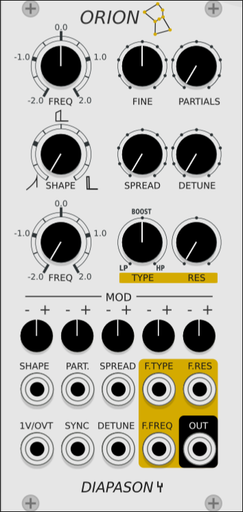

## DIAPASON Modules

# Orion

Orion is an additive oscillator providing the sum of 32 sinewaves (named partials).
## First row of knobs : 
- **FREQ** : select the frequency of the oscillator (from 2 octaves below to 2 octaves above).
- **FINE** : for slight adjustment of oscillator's tuning.
- **PARTIALS** : number of partials used to create the waveform (from 1 to 32).

## Second row of knobs : 
- **SHAPE** : allows user to select the waveform's shape (sawtooth on the left, square at mid-range and narrow pulsewave on the right).
- **SPREAD** and **DETUNE** : are two different algorithms which change the frequencies of each partials. The _spread_ is shifting the partials frequencies up whereas _detune_ shifts them up.

## Third row of knobs : (the filter)
- **FREQ** : adjust cutoff frequency of the filter.
- **TYPE** : morph between three types of filters : low-pass filter, boost and high pass filter.
- **RES** : classic resonance of the filter (which is also linked to the gain and narrowness in boost mode).

>Note : I made the choice to have a filter directly shaping the amplitude of each partial and not reproduce a classic LP/HP filter. So its behaving changes if you mess with partials's frequencies by using _detune_ or _spread_ algorithm (and then create some frequency sweeps).  

## CV Modulation :

The fourth row of knobs allows users to choose the amount of CV modulation (positive or negative) coming from the CV inputs just below. These knobs work within a range from -1 to 1 (no amplification). 

## CV Inputs : 

The different parameters mentioned above can fluctuate thanks to CV inputs. The pitch input is 1V/oct as usual. The sync function is actually a hard sync (wave starting again when gate detected).

# Builds/Releases

Mac, Linux and Windows builds of the latest version are available through Rack's Plugin Manager. (not yet)

# Building

You'll need to be set up to build VCV Rack itself. Under the Rack build directory, switch to plugins/, and then:

    git clone https://github.com/gle-bellier/Diapason-modules.git
    cd Diapason-modules
    make
